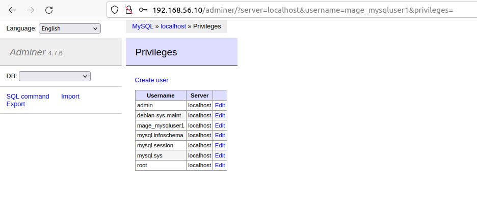
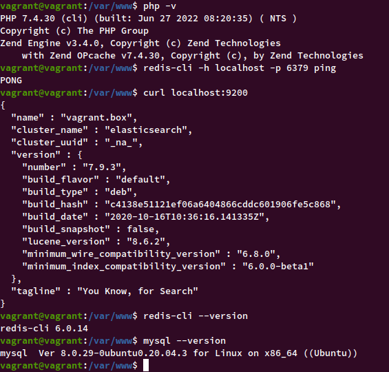
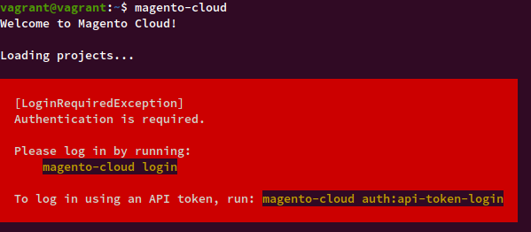

## HK2 Magento24 (Basant Mandal)
## The Complete Magento2.4 Compatible Box
<br>

#### This version is based on Ubuntu Server 20 & contains all applications necessary for Non Production Local Test Magento2.4 Development

<br>

**This Box has been tested on Ubuntu 20 Only** **`and Please use RSYNC or NFS for better Performance`**

<br>

**Includes all major components required for Magento2.4 Development** ✨- 
- Apache
- MySQL 8 & Adminer
- PHP 7.4
- Elastic Search 7
- Redis 6
- Git
- Composer
- Magento Cloud CLI 1.38.1

**Url's & Credentials**

- LocalHost = [192.168.56.10](http://192.168.56.10)
- Adminer = [adminer](http://192.168.56.10/adminer)
- Magento24 Vhost = http://www.magento24.vagrant
- MySQl UserName: mage_mysqluser1
- MySQL Password: wF9SZUV8A9qPDcUc
- MySQl UserName: admin
- MySQL Password: wF9SZUV8A9qPDcUc
- Vagrant Username & Password for Box = vagrant
- SSH - ssh vagrant

<br>

> Please add in your Host File else Virtual Host wont work

> 192.168.56.10  	www.magento24.vagrant

<br>


**Add Host in your Ubuntu/Debian**

- Open a Terminal window.
- Enter the following command to open the hosts file in a text editor:

```
sudo nano /etc/hosts
192.168.56.10  	www.magento24.vagrant
```

- Press Control-X 
- When you are asked if you want to save your changes, enter y 


In case any issue feel free to add your issues.

Please visit my [GitHub](https://github.com/basantmandal/vagrant_hk2_magento24) for Complete Details on How to Setup Magento24. [Basant GitHub Link - Vagrant HK2 Magento24](https://github.com/basantmandal/vagrant_hk2_magento24)

<br />

> **Screenshots**

<br />

1. **Adminer**

   

2. **MySQL Users**

   
 
3. **Application Version**

   

4. **MagentoCloud CLI**

   